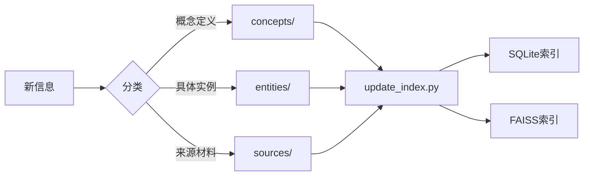

# 知识图谱

## 定义

知识图谱是一种以图结构组织知识的方法，通过**实体**（节点）和**关系**（边）来描述现实世界中的事物及其相互联系。在这个系统中，知识图谱采用 wiki 风格的文件系统组织，结合 SQLite 关系数据库存储实体间的关联。

## 核心元素

### 实体 (Entity)
知识图谱中的节点，代表具体的对象、事物或概念：
- 人物、组织、地点
- 技术组件、数据源
- 项目、文档
- 任何可被命名的"事物"

### 关系 (Relation)
连接实体的有向边，描述实体间的关系类型：
- `is_a` — 上下位关系（"A 是一种 B"）
- `part_of` — 组成关系（"A 是 B 的组成部分"）
- `depends_on` — 依赖关系
- `references` — 引用关系
- `related_to` — 一般关联

### 属性 (Property)
实体或关系的附加信息，以键值对形式存储。

## 在本系统中的组织

```
wiki/
├── concepts/    — 概念定义（什么是某事物）
├── entities/    — 实体描述（具体的事物实例）
├── sources/     — 知识来源（知识从何而来）
├── comparisons/ — 比较分析（事物间的异同）
└── index.md     — 全局索引和导航
```

## 与记忆层的协同

知识图谱（静态结构化知识）和记忆层（动态时间序列记忆）协同工作：

- **图谱提供骨架**: Wiki 条目定义了"what is what"的权威描述
- **记忆层提供上下文**: MemoryOS 记录"when and how"这些知识被使用
- **协同检索**: 混合检索同时查询图谱和记忆，提供结构化+上下文化的完整答案

## 使用工作流



## 维护建议

1. 新知识条目使用一致的 frontmatter 格式
2. 使用 `[[条目名]]` 建立跨条目引用
3. 添加知识后运行 `update_index.py` 同步索引
4. 定期审查过时条目并更新

## 参考来源

- [[混合检索]] — 图谱数据的检索方式
- [[向量语义搜索]] — 图谱内容的语义索引

---
*此条目描述了本系统知识组织方式的核心架构*
